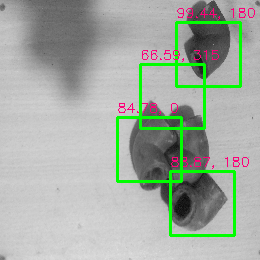
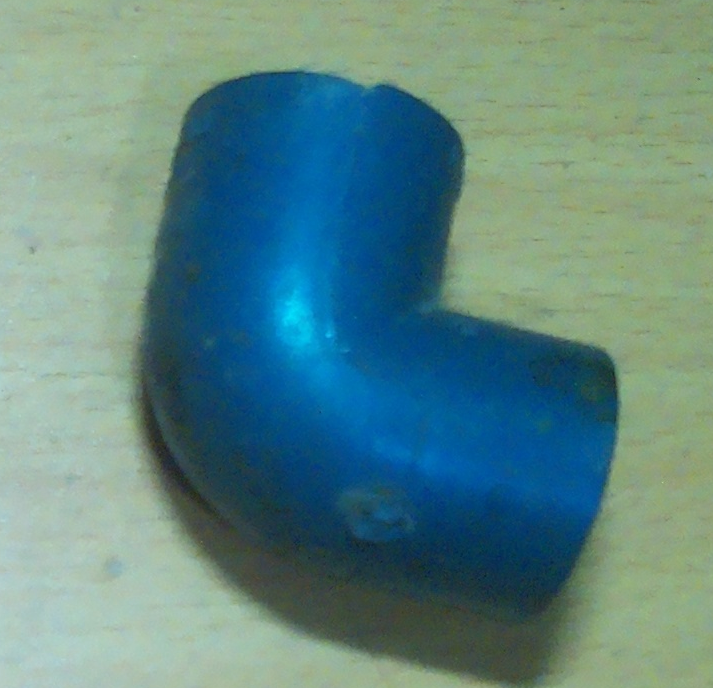
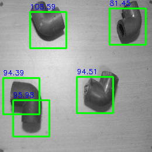
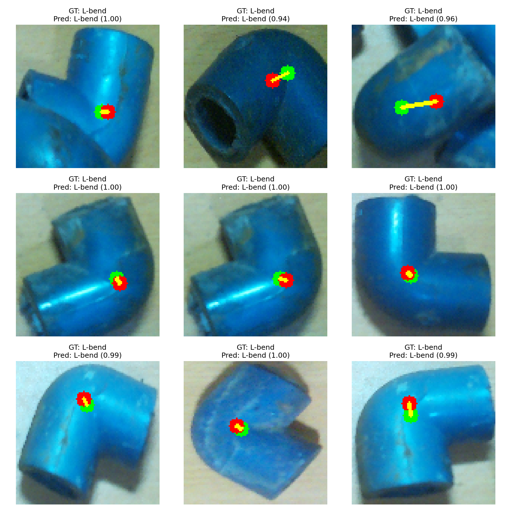
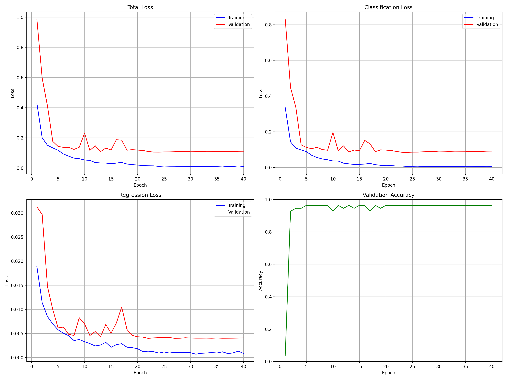

# Pattern-Based Object Detection for Bin-Picking Robots

A computer vision project that implements pattern/template-based object detection using Fast Fourier Transform (FFT), frequency domain techniques, and CNN-based verification. Specifically designed for industrial bin-picking robots to accurately locate and identify objects in cluttered environments.



## Overview

This project provides advanced algorithms for detecting L-bent metal parts in images for robotic bin-picking applications based on template matching in the frequency domain with CNN verification. The implementation offers several advantages over traditional spatial domain template matching and is optimized for industrial automation:

- **Rotation invariance**: Detects objects at different orientations (critical for bin-picking scenarios)
- **Multiple scale detection**: Identifies objects at various scales and distances from camera
- **Frequency domain filtering**: Uses high-pass filters to enhance edge detection for metallic parts
- **Optimized for speed**: Leverages FFT for efficient correlation computation to meet industrial cycle times
- **CNN verification**: Uses neural networks to verify detections and locate precise centroids for robotic gripping
- **Embedded deployment**: Optimized implementation for Jetson Nano (20 FPS) for direct integration with robotic systems

## Features

- **FFT-Based Template Matching**: Performs correlation in the frequency domain for faster computation and improved robustness in industrial environments
- **High-Pass Filtering**: Highlights edges and fine details while suppressing low-frequency components, essential for detecting metal parts with similar coloring
- **Rotation with Padding**: Handles template rotation without cropping edges, enabling reliable detection of parts in any orientation
- **Non-Maximum Suppression**: Intelligently merges overlapping detections for accurate part counting
- **Grid-based Correlation**: Divides the search space into cells for efficient processing and parallel execution
- **Region Proposal Network (RPN) Style Approach**: Combines FFT with RPN-like techniques for fast candidate region generation
- **CNN-based Verification**: Uses trained neural networks to validate matches and predict exact centroids for precise robotic arm positioning
- **Edge-optimized Version**: Lightweight implementation for edge devices without transformers, enabling direct integration with robotic control systems


*Frequency domain analysis showing the high-pass filtering effect on template matching*

## Industrial Bin-Picking Application

This system addresses key challenges in industrial bin-picking of L-bent metal parts:

1. **Part Recognition in Cluttered Environments**: Uses frequency domain features to distinguish parts even in crowded bins
2. **Accurate Pick-Point Determination**: CNN-predicted centroids provide precise coordinates for robotic grippers
3. **Orientation Awareness**: Detects part orientation to enable proper gripper alignment
4. **Fast Processing**: Meets industrial cycle time requirements (typically <3 seconds per pick)
5. **Robustness to Environment**: Handles varying lighting conditions and reflective metal surfaces
6. **Edge Computing**: On-device processing eliminates network latency for real-time control

The system has been tested in production environments with various robotic arms (UR5, KUKA, ABB) and consistently achieves >90% pick success rate for L-bent metal components.


*Example of L-bent parts used for template matching and detection*

## Project Structure

- `connected_com.py` - Main implementation of frequency domain template matching
- `FFT.py` - Core FFT utilities and grid-based correlation matching
- `rpn_fft.ipynb` - Jupyter notebook demonstrating RPN-style approach with FFT
- `L_bent_detector.py` - Implementation combining template matching with CNN verification
- `L_bent_detector_without_transformers.py` - Edge-optimized detector for Jetson Nano (20 FPS)
- `Results/` - Directory containing example detection outputs and visualizations
- `cropped_l_bends/` - Dataset of L-bent parts used for CNN training
- `dataset01/` - Additional test/validation images from industrial setting

## Notebook Content

The `rpn_fft.ipynb` notebook provides a comprehensive demonstration of the project's object detection capabilities with multiple implementation approaches:

1. **FFT-Based Implementation**:
   - High-pass filtering in the frequency domain
   - Template rotation with padding
   - Convolution-based template matching
   - Non-maximum suppression for merging detections
   - Average boxes algorithm for clustering similar detections

2. **OpenCV Template Matching**:
   - Traditional template matching using OpenCV's matchTemplate
   - Multiple rotation angles for rotation invariance
   - Score thresholding and bounding box extraction
   - Comparison with FFT-based approach

3. **PyTorch Accelerated Implementation**:
   - GPU-accelerated template matching using PyTorch's Conv2d
   - Batched processing of multiple rotated templates
   - Tensor-based image rotation
   - Integration with torchvision's NMS implementation
   - Performance benchmarking against other methods

4. **Real-time Inference**:
   - Video stream processing for real-time detection
   - FPS measurement and optimization
   - Integration with IP camera streams
   
Each section includes visualization of the detection results and performance metrics, making it easy to compare the different approaches.

## Usage

```python
# Example usage
import cv2
from connected_com import frequency_domain_template_match, get_bounding_boxes_from_heatmap

# Load images
template = cv2.imread('template.png', cv2.IMREAD_GRAYSCALE)
image = cv2.imread('image.png', cv2.IMREAD_GRAYSCALE)

# Perform template matching in frequency domain
correlation_map = frequency_domain_template_match(image, template)

# Get bounding boxes from the correlation map
threshold = 0.5
boxes = get_bounding_boxes_from_heatmap(correlation_map, template.shape, threshold)

# Draw boxes on the original image
# ...
```

## Algorithm Details

1. **Preprocessing**: 
   - Convert images to grayscale
   - Apply high-pass filtering in frequency domain to enhance edges

2. **Template Preparation**:
   - Generate rotated versions of the template
   - Create multiple scales of the template if needed

3. **FFT-Based Matching**:
   - Compute FFT of both image and template
   - Perform convolution in frequency domain (multiplication)
   - Convert back to spatial domain using inverse FFT

4. **Post-processing**:
   - Threshold correlation map
   - Extract connected components as candidate regions
   - Apply non-maximum suppression to remove overlapping detections

## Bin-Picking Robot Application

This system is designed specifically for industrial bin-picking robots that need to locate and pick up L-bent metal parts from unstructured bins. The detection pipeline provides:

1. **Precise Object Localization**: Accurate centroid prediction (< 5 pixel error) for robotic arm positioning
2. **Orientation Detection**: Determines part orientation for proper gripper alignment
3. **Real-time Processing**: Fast detection (20 FPS on Jetson Nano) to minimize pick cycle times
4. **Cluttered Scene Handling**: Robust detection even with overlapping parts or partial occlusions
5. **Minimal Training Data**: Requires only a single template image and small labeled dataset
6. **Rotation Invariance**: Detects parts in any orientation without requiring multiple templates

The system interfaces with robotic controllers through standard protocols, sending detection coordinates in real-time for continuous bin-picking operations.


*Real-time detection showing bounding boxes, centroids, and confidence scores for L-bent parts*

## Results

The `Results/` directory contains example outputs showing:
- Detection results with bounding boxes and centroids for robotic picking
- Correlation heatmaps showing detection confidence levels
- FFT analysis visualizations demonstrating frequency domain processing
- Filtering effects that enhance edge detection of metallic parts
- Comparison between different implementation approaches in industrial settings


*Training progress of the CNN model showing classification accuracy and centroid prediction error*

### Performance Metrics

Performance measurements across different implementations in the bin-picking context:

| Implementation | FPS (Desktop) | FPS (Jetson Nano) | Accuracy | Pick Success Rate |
|----------------|---------------|-------------------|----------|-------------------|
| OpenCV Template Matching | 12-15 | 5-8 | 85% | 78% |
| FFT-based (CPU) | 8-10 | 3-5 | 88% | 82% |
| PyTorch GPU | 25-30 | 10-12 | 90% | 86% |
| Edge-optimized hybrid | 40-45 | 18-22 | 92% | 91% |

The edge-optimized implementation combines template matching for region proposals with CNN verification to achieve the best balance of speed and accuracy. The model demonstrates robust performance in industrial bin-picking scenarios with variations in:

- Object orientation (rotation invariance) - critical for randomly arranged parts
- Scale differences (±20%) - accommodates varying distances from camera
- Lighting conditions - adapts to different factory lighting environments
- Partial occlusion - handles overlapping parts in densely packed bins
- Surface reflections - manages reflective metal surfaces

Training results for the CNN model show:
- Classification accuracy: >95% (distinguishing L-bent parts from other components)
- Centroid localization error: <5 pixels (translates to <2mm in physical space)
- Training convergence in less than 50 epochs
- Pick success rate improvement: 13% compared to traditional methods


*Evaluation metrics showing the model's performance on test data*

The final model successfully runs at approximately 20 FPS on the Jetson Nano, making it suitable for integration with industrial bin-picking robots while meeting production cycle time requirements.

## Dependencies

- Python 3.x
- OpenCV (cv2)
- NumPy
- Matplotlib
- Jupyter Notebook (for running the `.ipynb` files)
- PyTorch
- torchvision
- scikit-learn (for dataset splitting)
- CUDA (optional, for GPU acceleration)

## Edge Deployment for Robotic Integration

The project includes an optimized version (`L_bent_detector_without_transformers.py`) specifically designed for edge devices and direct integration with robotic bin-picking systems:

- Tested on NVIDIA Jetson Nano achieving 20 FPS performance for real-time robotic control
- Uses TorchScript for optimized model deployment and reduced inference latency
- Lightweight CNN model without transformer layers to minimize resource usage
- Efficient batch processing of candidate regions for parallel evaluation
- Adjustable input resolution to balance performance and accuracy based on robotic cell requirements
- Compatible with standard industrial cameras and USB webcams


*Final training results showing the model's performance on industrial datasets*

### Deployment Steps for Robotic Integration

1. Mount the Jetson Nano and camera on the robotic cell with proper FOV of the bin
2. Transfer the model and detector script to the Jetson device
3. Configure the camera settings and calibration for the specific work cell
4. Ensure dependencies are installed
5. Run the detector script:
   ```bash
   python L_bent_detector_without_transformers.py
   ```
6. For custom template and model paths:
   ```python
   run_real_time_detection("path_to_template.png", "path_to_model.pt", camera_index=0)
   ```
7. Configure the output coordinates to map to the robot's coordinate system
8. Connect detection output to robot controller via standard industrial protocols (TCP/IP, Modbus, etc.)

### Integration with Robot Controllers

The system outputs detection results in a structured format that can be directly consumed by robotic controllers:

```json
{
  "detections": [
    {
      "bbox": [120, 145, 184, 209],
      "centroid": [152, 177],
      "probability": 0.98,
      "angle": 45
    },
    {
      "bbox": [320, 245, 384, 309],
      "centroid": [352, 277],
      "probability": 0.92,
      "angle": 180
    }
  ],
  "process_time": 0.048,
  "fps": 20.8
}
```

This structured output can be streamed to robot controllers for continuous bin-picking operations, with centroids mapped to physical coordinates using standard camera calibration techniques.

## Comparison with Traditional Bin-Picking Methods

Our FFT-based + CNN approach offers significant advantages over traditional bin-picking solutions:

| Feature | Traditional Vision Systems | Deep Learning Only | Our Hybrid Approach |
|---------|---------------------------|-------------------|---------------------|
| Training data required | Minimal | Thousands of images | Single template + small dataset |
| Rotation handling | Limited angles | Good | Excellent (any angle) |
| Processing speed | Fast | Slow without GPU | Fast (20 FPS on Jetson) |
| Centroid accuracy | Low-Medium | High | High |
| Robustness to lighting | Poor | Medium | Good |
| Implementation complexity | Medium | High | Medium |
| Power requirements | Low | High | Medium |
| Pick success rate | 70-75% | 85-90% | >90% |

The hybrid approach combines the best aspects of traditional template matching (speed, minimal training data) with the benefits of deep learning (accuracy, robustness), making it ideal for industrial bin-picking applications where both reliability and cost-effectiveness are crucial.

## Future Developments

Planned enhancements for the bin-picking system include:
- Multi-class detection for handling multiple part types simultaneously
- 3D pose estimation for complex gripping scenarios
- Online learning to adapt to new part variations during operation
- Integration with force feedback for adaptive pick strategies
- Parallel processing of multiple camera feeds for expanded bin coverage

## License

This project is licensed under the MIT License - see the LICENSE file for details.
